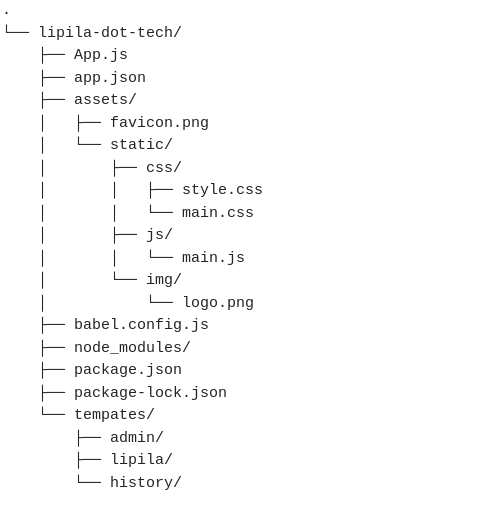

# lipila UI
Mobile user interface

### Project structure

### Contribution
Make contributions as assigned by the project manager.

1. Fork the repository.
2. Create a new branch for your changes.
3. Make changes and commit them.
4. Submit a pull request.

**UI Design Working Directory**
- HTML code -> templates/
- CSS -> assets/css/style.css
- JS -> assets/js/main.js
- Images -> assets/img/
- vender stylesheets -> assets/
  
### Contributors

`peter zyambo - zyambopeter1@gmail.com`
